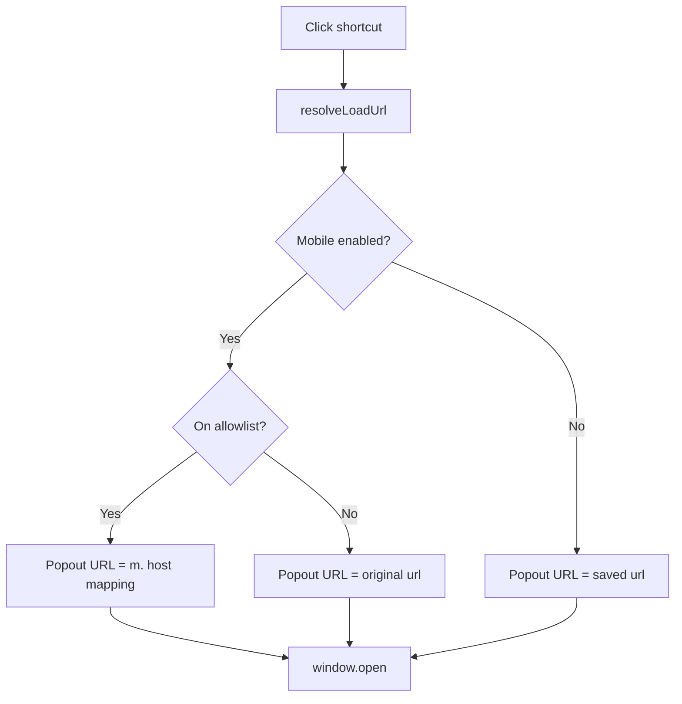

# Architecture

**Language:** [简体中文](ARCHITECTURE.zh-CN.md) · [English](ARCHITECTURE.md)

| Doc version | 2.1.7 |

## 1. Overview

Manifest V3 extension: **Side Panel** shows a vertical shortcut list; clicks open sites in a **popout window** via `window.open` (`resolveLoadUrl` for mobile host allowlist). No iframe embedding or DNR.

## 2. Modules

| File | Role |
|------|------|
| `shared.js` | Storage, `toMobileUrl`, `resolveLoadUrl`, `settings.locale` |
| `i18n.js` | UI strings (zh/en), `t()`, `applyDocumentI18n` |
| `background.js` | Action title on install/locale change, default shortcuts |
| `sidepanel.js` | Vertical list, popout open/focus |
| `options.js` | CRUD, global language and mobile mode |

## 3. URL resolution

**Invariant:** `shortcut.url` in sync storage is never rewritten by mobile logic.

### Allowlist (`HOST_TO_MOBILE`)

| Desktop host | Mobile host |
|--------------|-------------|
| www.bilibili.com | m.bilibili.com |
| www.weibo.com | m.weibo.cn |

## 4. Popout windows

- One named window per shortcut (`sidebar-popout-{id}`); reuse focuses and navigates
- ~420px wide, height capped; cascaded position from the right
- Normal top-level browsing context (cookies, login, QR same as tabs)

## 5. Side panel UI

- Vertical list + settings only — no iframe, tabs, or URL bar
- `lastShortcutId` highlights last opened shortcut (does not auto-open on load)

## 6. Storage keys

| Key | Purpose |
|-----|---------|
| `shortcuts` | User entries (saved `url` is canonical) |
| `settings.defaultMobileMode` | Global mobile default |
| `settings.locale` | `null` = browser; `zh` / `en` |
| `lastShortcutId` | Last clicked shortcut (highlight) |

## 7. Permissions

`storage`, `sidePanel` only (v2.0.0 removed `declarativeNetRequest`, `cookies`, `<all_urls>`).

## 8. Design decision: no iframe embedding

v1.x loaded sites in iframes inside `sidepanel.html`, with DNR (strip framing headers, mobile UA, cookie sync for some hosts). Side Panel cannot host arbitrary URLs directly; iframe cookie partitioning, anti-framing, and broken login/QR made the UX poor, so v2.0.0 removed it. See README “Why we dropped in-panel preview” and [CHANGELOG.md](../CHANGELOG.md).
