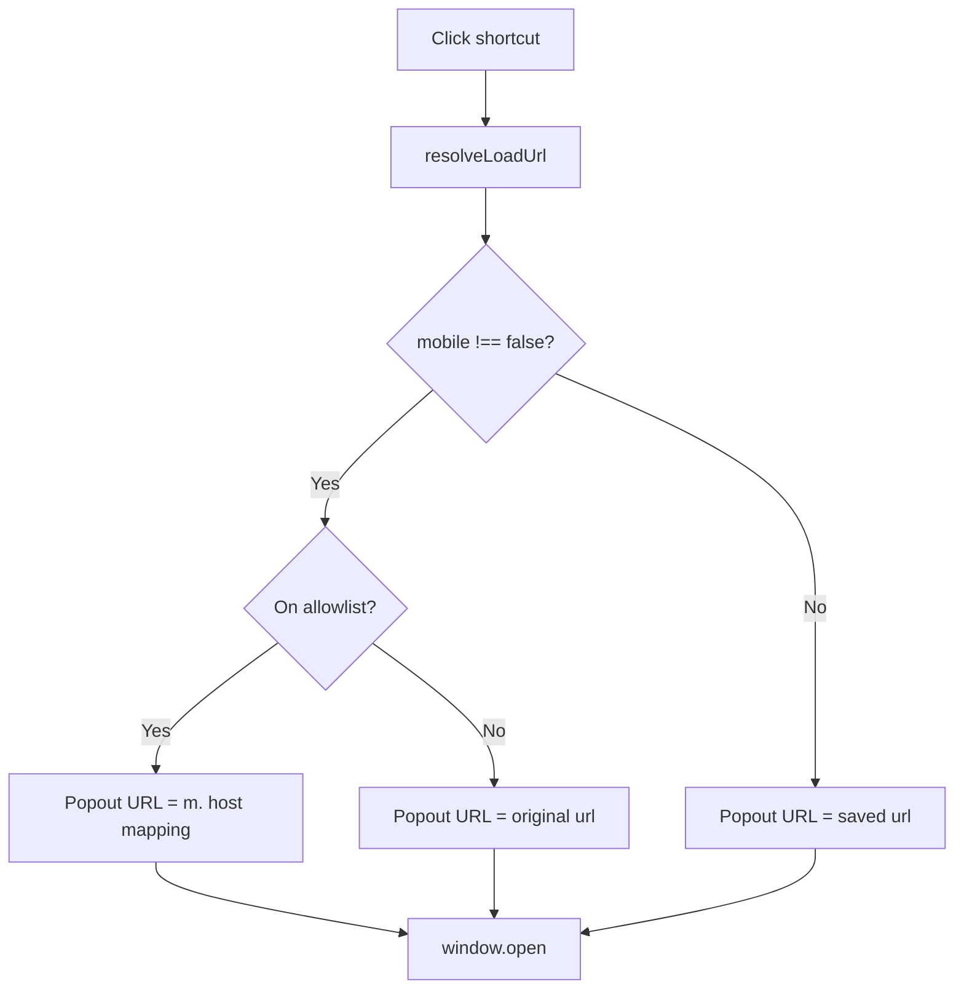

# Architecture

**Language:** [简体中文](ARCHITECTURE.zh-CN.md) · [English](ARCHITECTURE.md)

| Doc version | 2.2.4 |

## 1. Overview

Manifest V3 extension: **Side Panel** shows a vertical shortcut list; clicks open sites in a **popout window** via `window.open` (`resolveLoadUrl` for mobile host allowlist). Since v2.0.0: no iframe embedding or DNR.

## 2. Modules

| File | Role |
|------|------|
| `shared.js` | Storage, `toMobileUrl`, `resolveLoadUrl`, favicon helpers |
| `theme.js` | `applyTheme` / `initTheme` (`data-theme`: system / light / dark) |
| `backup.js` | JSON export/import, `applyBackupImport` (merge / replace) |
| `i18n.js` | UI strings (zh/en), `t()`, `applyDocumentI18n` |
| `background.js` | Action title, default shortcuts on first install |
| `sidepanel.js` | Vertical list, popout open/focus, theme + storage listeners |
| `options.js` | Add form (left), list + inline edit (right), import/export, locale & theme |

## 3. URL resolution

**Invariant:** `shortcuts[].url` is never rewritten by mobile logic.

### Allowlist (`HOST_TO_MOBILE`)

| Desktop host | Mobile host |
|--------------|-------------|
| www.bilibili.com | m.bilibili.com |
| www.weibo.com | m.weibo.cn |

## 4. Popout windows

- One named window per shortcut (`sidebar-popout-{id}`); reuse focuses and navigates
- ~420px wide, height capped; cascaded position from the right
- Normal top-level browsing context (cookies, login, QR same as tabs)

## 5. Side panel UI

- Vertical list + settings only — no iframe
- Icons: `/_favicon/` (requires `favicon` permission) with fallbacks
- `lastShortcutId` highlights last opened shortcut (does not auto-open on load)

## 6. Options page

- **Layout:** global settings full width; below — add form (left), saved list (right); stacks on narrow viewports
- **Inline edit:** **Edit** on a row expands the form in place
- **Backup:** **Import** / **Export** in the saved-list header; import picks merge or replace, then a JSON file
- **Header:** author + GitHub link and version on the title row (right)

## 7. Storage keys

| Key | Purpose |
|-----|---------|
| `shortcuts` | User entries (saved `url` is canonical) |
| `shortcut.mobile` | `true` or omitted/`null` → mobile; `false` → desktop |
| `settings.locale` | `null` = browser; `zh` / `en` |
| `settings.theme` | `system` / `light` / `dark` |
| `lastShortcutId` | Last clicked shortcut (highlight) |

Writes go to `chrome.storage.local` and `chrome.storage.sync` (local kept if sync fails).

## 8. Permissions

`storage`, `sidePanel`, `favicon` (v2.0.0 removed `declarativeNetRequest`, `cookies`, `<all_urls>`).

## 9. Design decision: no iframe embedding

v1.x loaded sites in iframes inside `sidepanel.html`, with DNR and cookie workarounds. Side Panel cannot host arbitrary URLs directly; iframe cookie partitioning, anti-framing, and broken login/QR made the UX poor, so v2.0.0 removed it. See README “Why we dropped in-panel preview” and [CHANGELOG.md](../CHANGELOG.md).
