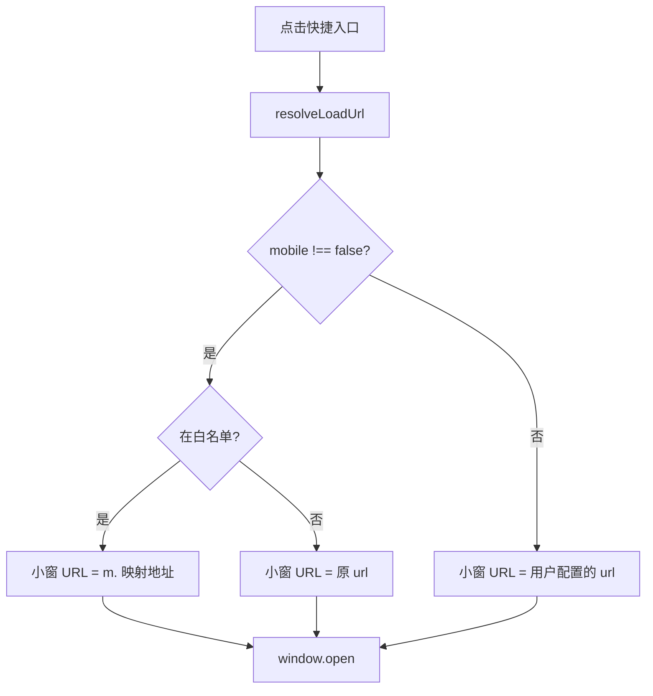

# 技术架构说明

**语言：** [简体中文](ARCHITECTURE.zh-CN.md) · [English](ARCHITECTURE.md)

| 文档版本 | 2.2.3 |

## 1. 概述

Manifest V3 扩展：**Side Panel** 展示纵向快捷列表；点击通过 `window.open` 在**独立小窗**加载站点（`resolveLoadUrl` 处理移动域名白名单）。v2.0.0 起不再使用 iframe 内嵌或 DNR。

## 2. 模块划分

| 文件 | 职责 |
|------|------|
| `shared.js` | 存储读写、`toMobileUrl`、`resolveLoadUrl`、`getFaviconCandidateUrls`、`createShortcutIcon` |
| `theme.js` | `applyTheme` / `initTheme`（`data-theme`：system / light / dark） |
| `backup.js` | 导出/解析 JSON 备份、`applyBackupImport`（合并/替换） |
| `i18n.js` | 界面文案（中/英）、`t()`、`applyDocumentI18n` |
| `background.js` | 扩展图标悬停标题、首次安装预置快捷方式 |
| `sidepanel.js` | 纵向快捷列表、小窗打开与聚焦、主题与 storage 监听 |
| `options.js` | 左侧添加入口、右侧列表与内联编辑、导入/导出、全局语言与主题 |

## 3. URL 解析

**不变量：** `shortcuts[].url` 不会被移动版逻辑改写。

### 白名单（`HOST_TO_MOBILE`）

| 桌面主机 | 移动主机 |
|----------|----------|
| www.bilibili.com | m.bilibili.com |
| www.weibo.com | m.weibo.cn |

## 4. 小窗（Popout）

- 每个快捷方式对应命名窗口 `sidebar-popout-{id}`；已存在则 `focus` 并 `location.href` 更新
- 尺寸约 420×（屏高−48），靠右叠放偏移（`POPOUT_CASCADE`）
- 小窗为正常顶层浏览上下文，Cookie / 登录 / 扫码与标签页一致

## 5. 侧栏 UI

- 仅纵向列表 + 设置按钮，无 iframe
- 列表项图标：`/_favicon/`（需 `favicon` 权限）+ 多级回退
- `lastShortcutId` 用于高亮上次打开的入口（不自动弹窗）

## 6. 设置页（Options）

- **布局：** 全局设置通栏；下方左「添加快捷入口」、右「已保存的入口」（宽屏双栏，窄屏堆叠）
- **内联编辑：** 列表项「编辑」展开表单，就地修改，无需滚回左侧
- **备份：** 标题栏「导入配置 / 导出配置」；导入先选合并或替换，再选 JSON 文件（`backup.js`）
- **页眉：** 标题行右侧作者信息与 GitHub 仓库链接、当前版本号

## 7. 存储 Key

| Key | 说明 |
|-----|------|
| `shortcuts` | 用户入口（`url` 为原始地址） |
| `shortcut.mobile` | `true` 或省略/`null` → 移动版；`false` → 桌面版 |
| `settings.locale` | `null` 跟随浏览器；`zh` / `en` |
| `settings.theme` | `system` / `light` / `dark` |
| `lastShortcutId` | 上次点击的入口（高亮） |

写入时同时更新 `chrome.storage.local` 与 `chrome.storage.sync`（sync 失败时保留本机副本）。

## 8. 权限

`storage`、`sidePanel`、`favicon`（v2.0.0 起不再需要 `declarativeNetRequest`、`cookies`、`<all_urls>`）。

## 9. 设计决策：放弃 iframe 内嵌

v1.x 在 `sidepanel.html` 内用 iframe 加载外站，并配合 DNR、移动 UA、Cookie 同步等。因 Side Panel 无法直接导航外站、iframe Cookie 分区、站点反嵌套及登录失败等问题，v2.0.0 已移除。详见 README「为何不做侧栏内嵌预览」与 [CHANGELOG.md](../CHANGELOG.md)。
