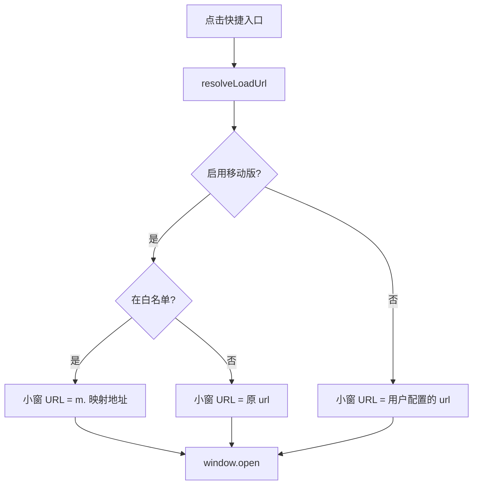

# 技术架构说明

**语言：** [简体中文](ARCHITECTURE.zh-CN.md) · [English](ARCHITECTURE.md)

| 文档版本 | 2.0.0 |

## 1. 概述

Manifest V3 扩展：**Side Panel** 展示纵向快捷列表；点击通过 `window.open` 在**独立小窗**加载站点（`resolveLoadUrl` 处理移动域名白名单）。不再使用 iframe 内嵌或 DNR。

## 2. 模块划分

| 文件 | 职责 |
|------|------|
| `shared.js` | 存储、`toMobileUrl`、`resolveLoadUrl`、`settings.locale` |
| `i18n.js` | 界面文案（中/英）、`t()`、`applyDocumentI18n` |
| `background.js` | 扩展图标悬停标题、首次安装默认数据 |
| `sidepanel.js` | 纵向快捷列表、小窗打开与聚焦 |
| `options.js` | 增删改、全局语言与移动版设置 |

## 3. URL 解析

**不变量：** `chrome.storage.sync` 中的 `shortcut.url` 不会被移动版逻辑改写。

### 白名单（`HOST_TO_MOBILE`）

| 桌面主机 | 移动主机 |
|----------|----------|
| www.bilibili.com | m.bilibili.com |
| www.weibo.com | m.weibo.cn |

## 4. 小窗（Popout）

- 每个快捷方式对应命名窗口 `sidebar-popout-{id}`；已存在则 `focus` 并 `location.href` 更新
- 尺寸约 420×（屏高−48），靠右叠放偏移（`POPOUT_CASCADE`）
- 小窗为正常顶层浏览上下文，Cookie / 登录 / 扫码与标签页一致

## 5. 侧栏 UI

- 仅纵向列表 + 设置按钮，无 iframe、无标签栏、无地址栏
- `lastShortcutId` 用于高亮上次打开的入口（不自动弹窗）

## 6. 存储 Key

| Key | 说明 |
|-----|------|
| `shortcuts` | 用户入口（`url` 为原始地址） |
| `shortcut.mobile` | `true` / 省略 / `null` → 移动版；`false` → 桌面版 |
| `settings.locale` | `null` 跟随浏览器；`zh` / `en` |
| `lastShortcutId` | 上次点击的入口（高亮） |

## 7. 权限

`storage`、`sidePanel`（v2.0.0 起不再需要 `declarativeNetRequest`、`cookies`、`<all_urls>`）。

## 8. 设计决策：放弃 iframe 内嵌

v1.x 在 `sidepanel.html` 内用 iframe 加载 `resolveLoadUrl()` 结果，并配合 DNR 去嵌入限制头、移动 UA、部分站点 Cookie 同步。因 Side Panel 无法直接导航到外站、iframe Cookie 分区、站点反嵌套及登录/扫码失败等问题，该路径对用户不友好，v2.0.0 已移除。详见 README「为何不做侧栏内嵌预览」与 [CHANGELOG.md](../CHANGELOG.md)。
